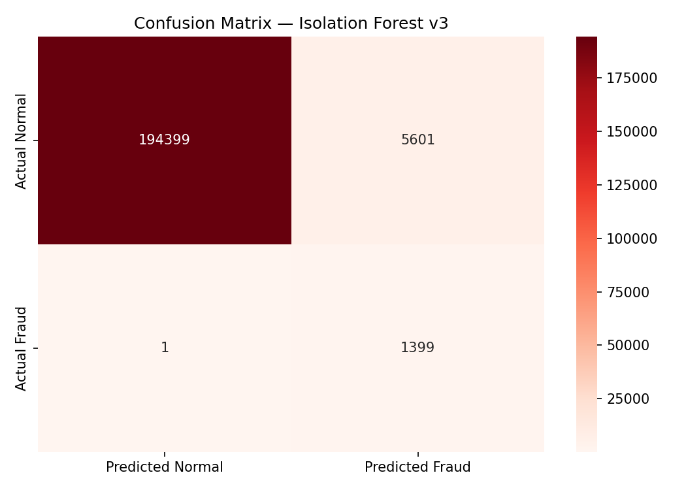
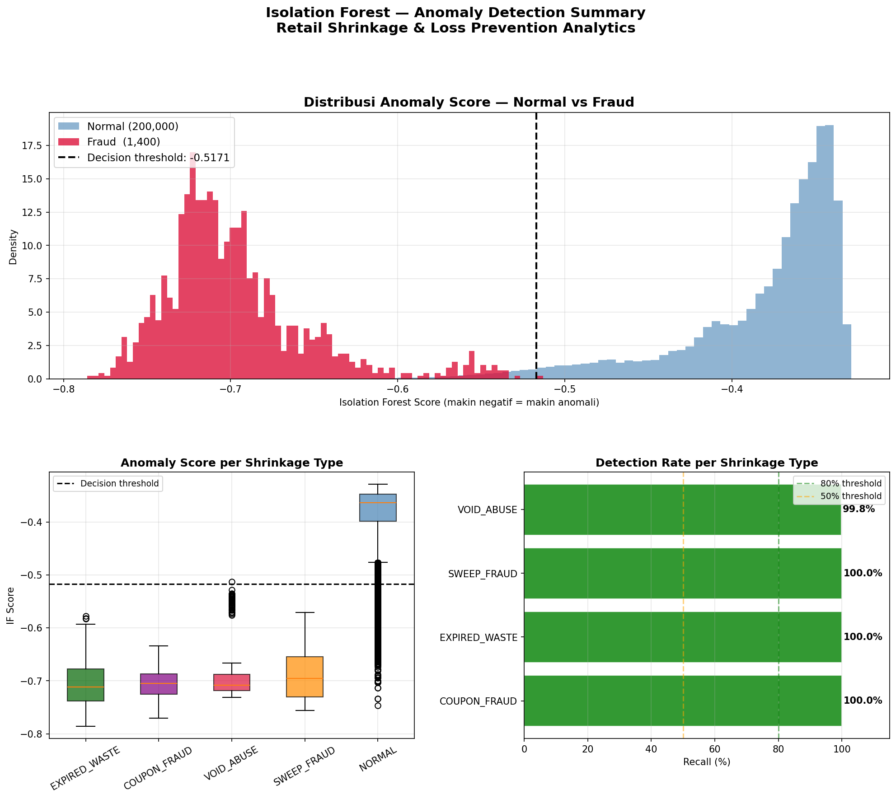
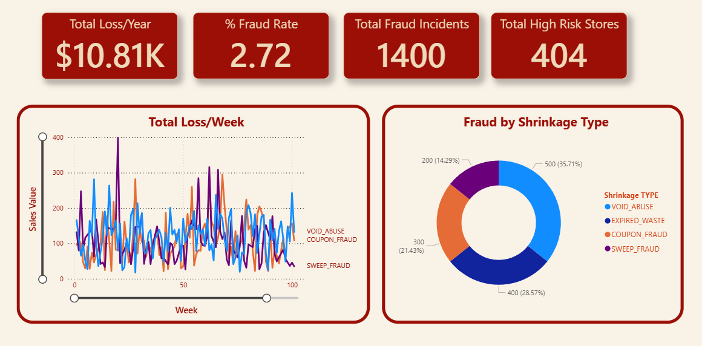
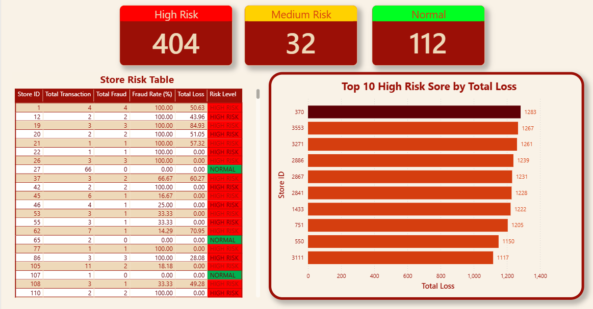
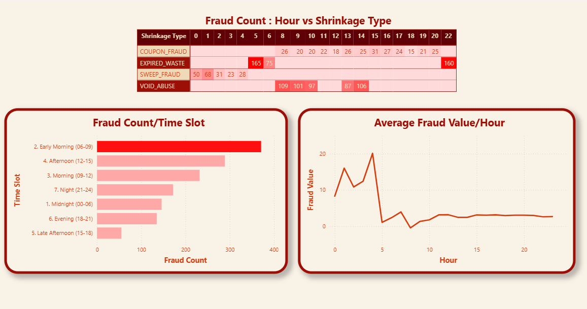
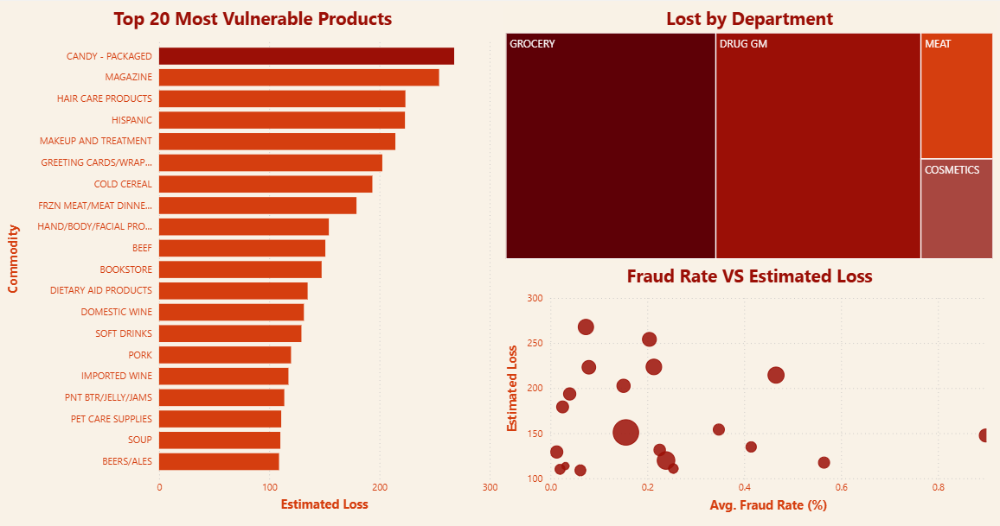
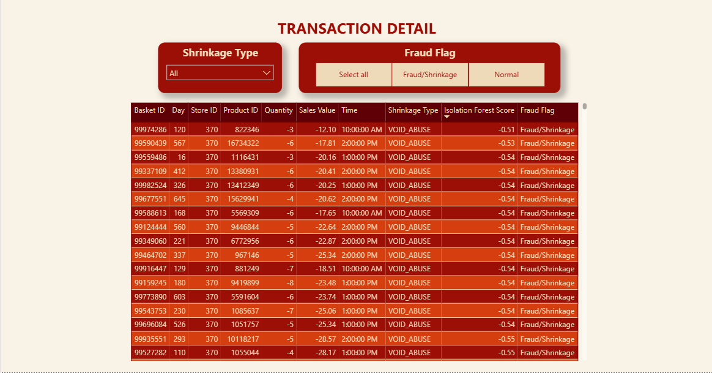

# 🏬 Retail Shrinkage & Loss Prevention Analytics


> **End-to-end Loss Prevention Analytics project** yang mendeteksi pola shrinkage pada data transaksi retail menggunakan anomaly detection, SQL analysis, dan interactive dashboard.

---

## 📌 Latar Belakang

Setiap retailer kehilangan **1–3% revenue** dari shrinkage — kerugian akibat pencurian, produk expired, dan administrative error. Tim Loss Prevention membutuhkan data yang akurat untuk mengetahui **di mana dan kapan** kerugian terjadi.

Project ini mensimulasikan sistem deteksi shrinkage berbasis data menggunakan dataset transaksi nyata dari **Dunnhumby "The Complete Journey"** yang diperkaya dengan simulasi data shrinkage yang realistis.

---

## 🎯 Business Questions

| # | Pertanyaan | Metode |
|---|-----------|--------|
| 1 | Kategori produk mana yang paling rentan shrinkage? | SQL + Power BI |
| 2 | Apakah ada pola waktu yang berkorelasi dengan anomali transaksi? | SQL + Heatmap |
| 3 | Store mana yang memiliki void/refund rate di luar batas normal? | SQL + Alert Dashboard |
| 4 | Berapa estimasi kerugian tahunan dan kategori mana prioritas intervensi? | SQL + DAX |

---

## 🗂️ Project Structure

```
retail_shrinkage_analytics/
│
├── 📁 raw_data/                    # Dataset Dunnhumby (tidak di-commit)
│   ├── transaction_data.csv        # 2.5 juta transaksi
│   ├── product.csv                 # 92,353 produk
│   └── hh_demographic.csv
│
├── 📁 data/                        # Processed data (tidak di-commit)
│   ├── transactions_with_shrinkage.csv
│   ├── transactions_with_predictions.csv
│   └── retail_shrinkage.db
│
├── 📁 notebooks/
│   ├── 01_explore.ipynb            # Eksplorasi & analisis data awal
│   ├── 02_shrinkage_simulation.ipynb  # Simulasi data shrinkage
│   ├── 03_sql_analysis.ipynb       # SQL queries & business insights
│   └── 04_isolation_forest.ipynb   # Anomaly detection model
│
├── 📁 sql/                         # SQL query files
│
├── 📁 outputs/                     # Charts, model, Excel exports
│   ├── confusion_matrix_v3.png
│   ├── anomaly_score_full_analysis.png
│   ├── sql_analysis_results.xlsx
│   ├── isolation_forest_v3.pkl
│   └── powerbi_data.xlsx
│
├── .gitignore
├── requirements.txt
└── README.md
```

---

## 📊 Dataset

**Dunnhumby "The Complete Journey"** — dataset transaksi supermarket nyata selama 2 tahun dari 2,500 household.

| File | Rows | Keterangan |
|------|------|-----------|
| transaction_data.csv | 2,595,732 | Transaksi utama |
| product.csv | 92,353 | Info produk & kategori |
| hh_demographic.csv | 801 | Data demografis household |

> ⬇️ **Download dataset:** [Kaggle — Dunnhumby The Complete Journey](https://www.kaggle.com/datasets/frtgnn/dunnhumby-the-complete-journey)
>
> Setelah download, ekstrak ke folder `raw_data/`

---

## 🔍 Metodologi

### Phase 1: Exploratory Data Analysis

Analisis awal terhadap 2.5 juta transaksi untuk mengidentifikasi anomali yang sudah ada secara natural di data:

```
2,595,732 transaksi
└── 18,850 zero sales (0.73%)
    ├── 14,399 ghost transaction  → QUANTITY = 0, administrative error
    ├──  8,704 free promo item    → legitimate discount
    └──    702 suspicious         → QUANTITY > 0, SALES_VALUE = 0, tanpa diskon
               └── Didominasi: BAG SNACKS & COUPON products
                   Tersebar di: 116 stores
```

**Temuan awal:** Departemen `DRUG GM` dan `GROCERY` mendominasi suspicious transactions, dengan produk `COUP/STR & MFG` muncul di 38 store berbeda dengan 323 kejadian.

---

### Phase 2: Shrinkage Simulation

Dataset Dunnhumby tidak memiliki label fraud — sehingga kita mensimulasikan 4 tipe shrinkage berdasarkan pola bisnis yang realistis:

| Tipe Shrinkage | Simulasi | Karakteristik |
|---------------|----------|--------------|
| **Void Abuse** | 500 records | SALES_VALUE negatif besar, produk mahal (quantile >85%), jam kerja normal |
| **Sweep Fraud** | 200 records | Transaksi jam 00:00–05:00, SALES_VALUE 8x rata-rata, QUANTITY besar |
| **Coupon Fraud** | 300 records | SALES_VALUE = 0, COUPON_DISC ekstrem (-$20 sampai -$50) |
| **Expired Waste** | 400 records | QUANTITY batch besar (20–80 unit), jam buka/tutup toko |

```python
# Contoh: Simulasi Void Abuse
def simulate_void_abuse(transactions, n_fraudulent_stores=10, voids_per_store=50):
    expensive_products = transactions[
        transactions['SALES_VALUE'] > transactions['SALES_VALUE'].quantile(0.85)
    ]['PRODUCT_ID'].unique()
    # Inject transaksi void di store terpilih...
```

**Final dataset:** 2,597,132 rows (2,595,732 normal + 1,400 fraud)

---

### Phase 3: SQL Analysis

4 business questions dijawab menggunakan SQL queries dengan SQLite:

#### BQ1 — Kategori Produk Paling Rentan
```sql
SELECT p.DEPARTMENT, p.COMMODITY_DESC,
       COUNT(*) AS total_transactions,
       SUM(CASE WHEN t.IS_FRAUD = 1 THEN 1 ELSE 0 END) AS fraud_count,
       ROUND(SUM(...) * 100.0 / COUNT(*), 4) AS fraud_rate_pct
FROM transactions t
LEFT JOIN products p ON t.PRODUCT_ID = p.PRODUCT_ID
GROUP BY p.DEPARTMENT, p.COMMODITY_DESC
HAVING fraud_count > 0
ORDER BY estimated_loss DESC
```

**Hasil:** COSMETICS punya `fraud_rate 0.69%` — tertinggi meskipun nominal loss-nya kecil. DRUG GM punya total loss $1,791/tahun dari dua tipe shrinkage.

#### BQ2 — Pola Waktu Anomali
Menggunakan CTE untuk kategorisasi waktu:

| Time Slot | Fraud Rate | Avg Fraud Value |
|-----------|-----------|----------------|
| Midnight (00–06) | 0.35% | **$26.46** ← tertinggi |
| Early Morning (06–09) | **0.63%** ← tertinggi | $2.42 |
| Afternoon (12–15) | 0.05% | $7.51 |

**Insight:** Jam 00–06 = sedikit kejadian tapi nilai per fraud sangat tinggi (Sweep Fraud). Jam 06–09 = banyak kejadian saat pergantian shift.

#### BQ3 — Store Risk Assessment
Menggunakan minimum threshold 1,000 transaksi untuk menghindari *small sample size problem*:

```
🔴 HIGH RISK   : 4 stores  (fraud_rate > 0.22%)
🟡 MEDIUM RISK : 3 stores  (fraud_rate 0.11%–0.22%)
🟢 NORMAL      : 13 stores (fraud_rate < 0.11%)
```

#### BQ4 — Estimasi Kerugian Tahunan
Proyeksi dari 2 tahun data → estimasi per tahun (× 0.5):

| Department | Shrinkage Type | Est. Annual Loss | Priority |
|-----------|---------------|-----------------|---------|
| GROCERY | SWEEP_FRAUD | $1,212 | 🟢 MONITOR |
| DRUG GM | VOID_ABUSE | $922 | 🟡 WARNING |
| DRUG GM | SWEEP_FRAUD | $870 | 🟡 WARNING |
| COSMETICS | VOID_ABUSE | $112 | 🔴 CRITICAL |

---

### Phase 4: Anomaly Detection — Isolation Forest

#### Cara Kerja Isolation Forest
Isolation Forest mendeteksi anomali berdasarkan prinsip: **data yang mudah diisolasi = anomali**. Model membangun decision trees secara random dan mengukur berapa banyak split yang diperlukan untuk mengisolasi setiap data point.

```
Transaksi Normal  → butuh banyak split untuk diisolasi (score ≈ -0.38)
Transaksi Fraud   → langsung terisolasi dengan sedikit split (score ≈ -0.70)
```

#### Iterasi Model

| Versi | Features | Contamination | Recall |
|-------|---------|--------------|--------|
| v1 | 6 basic features | 0.054% | 20.3% |
| v2 | +5 behavioral features | 0.054% | 37.7% |
| **v3** | **+6 store-level features** | **1.39%** | **99.9%** ✅ |

#### Feature Engineering

**Behavioral Features (v2):**
```python
is_odd_hour       # transaksi jam 00–06 atau >22:00
is_negative_sale  # SALES_VALUE < 0
discount_ratio    # (RETAIL_DISC + COUPON_DISC) / SALES_VALUE
zero_sale_no_disc # SALES_VALUE = 0 tanpa diskon apapun
abs_sales         # nilai absolut SALES_VALUE
```

**Store-level Features (v3):**
```python
store_transaction_count  # volume transaksi per store
store_avg_sales          # rata-rata sales per store
store_negative_rate      # proporsi transaksi negatif per store
store_odd_hour_rate      # proporsi transaksi jam tidak wajar per store
store_avg_abs_sales      # rata-rata absolute sales per store
store_zero_sale_rate     # proporsi zero sale per store
```

#### Hasil Final (Model v3)

```
Dataset training : 201,400 rows (200k normal + 1,400 fraud)
                   *sampling diperlukan karena keterbatasan RAM

Confusion Matrix:
                 Predicted Normal  Predicted Fraud
Actual Normal       194,399            5,601
Actual Fraud              1            1,399

Recall    : 99.9%  (1,399 dari 1,400 fraud terdeteksi)
Precision : 20.0%
```

> **Catatan:** False positive 5,601 adalah trade-off yang acceptable dalam konteks Loss Prevention — lebih baik investigasi lebih banyak transaksi daripada melewatkan fraud.

#### 📸 Model Output

**Confusion Matrix — Model v3**


**Anomaly Score Distribution**


---

### Phase 5: Power BI Dashboard

Dashboard Loss Prevention interaktif dengan 5 halaman:

| Page | Konten |
|------|--------|
| **Executive Overview** | KPI cards, trend loss/minggu, donut chart by shrinkage type |
| **Store Risk Monitor** | Alert table 🔴🟡🟢, top 10 high risk stores |
| **Time Pattern Analysis** | Heatmap waktu × shrinkage type, bar chart per time slot |
| **Product Vulnerability** | Top produk rentan, treemap by department, scatter plot |
| **Transaction Detail** | Tabel interaktif dengan filter shrinkage type & fraud flag |

**DAX Measures yang digunakan:**
```dax
// Total kerugian tahunan
Est. Annual Loss = 
SUMX(FILTER(fact_transactions, fact_transactions[IS_FRAUD] = 1),
     ABS(fact_transactions[SALES_VALUE]) + 
     ABS(fact_transactions[COUPON_DISC])) * 0.5

// Alert threshold per store
Risk Level Color = 
SWITCH(TRUE(),
    SELECTEDVALUE(dim_stores[risk_level]) = "HIGH RISK", "#FF0000",
    SELECTEDVALUE(dim_stores[risk_level]) = "MEDIUM RISK", "#FFA500",
    "#00B050")
```

#### 📸 Dashboard Preview

**Page 1 — Executive Overview**


**Page 2 — Store Risk Monitor**


**Page 3 — Time Pattern Analysis**


**Page 4 — Product Vulnerability**


**Page 5 — Transaction Detail**


---

## 💡 Key Insights

1. **COSMETICS adalah departemen paling kritis** — meskipun nominal loss hanya $112/tahun, loss rate 0.69% sangat tinggi relatif terhadap revenue-nya yang kecil ($32,360).

2. **Jam 00–06 adalah waktu paling berbahaya** — avg fraud value $26.46, hampir 4x lebih tinggi dari jam normal. Rekomendasi: tambah monitoring kamera dan batasi akses sistem di luar jam operasional.

3. **Void Abuse dan Sweep Fraud mendominasi** — dua tipe ini bertanggung jawab atas mayoritas estimated loss. Keduanya dapat dideteksi dari pola transaksi tanpa perlu data tambahan.

4. **116 stores terlibat suspicious transactions** — tersebar luas mengindikasikan kemungkinan system/administrative issue, bukan fraud individu.

5. **Shrinkage loss cenderung stabil** sepanjang 2 tahun — mengindikasikan tidak ada intervensi efektif yang dilakukan. Loss Prevention perlu strategi proaktif berbasis data.

---

## 🛠️ Tech Stack

| Tool | Kegunaan |
|------|---------|
| **Python 3.11** | Data processing, simulasi, modeling |
| **Pandas & NumPy** | Manipulasi dan analisis data |
| **Scikit-learn** | Isolation Forest anomaly detection |
| **SQLite3** | Database untuk SQL analysis |
| **Matplotlib & Seaborn** | Visualisasi hasil model |
| **Power BI** | Interactive Loss Prevention Dashboard |
| **Joblib** | Model serialization |

---

## ⚙️ Setup & Instalasi

```bash
# 1. Clone repository
git clone https://github.com/FailFudhayl/Retail_Shrinkage_DataAnalystics.git
cd Retail_Shrinkage_DataAnalystics/retail_shrinkage_analytics

# 2. Buat virtual environment
python -m venv venv
venv\Scripts\activate  # Windows

# 3. Install dependencies
pip install -r requirements.txt

# 4. Download dataset
# Download dari: https://www.kaggle.com/datasets/frtgnn/dunnhumby-the-complete-journey
# Ekstrak ke folder raw_data/

# 5. Jalankan notebooks secara berurutan
# notebooks/01_explore.ipynb
# notebooks/02_shrinkage_simulation.ipynb
# notebooks/03_sql_analysis.ipynb
# notebooks/04_isolation_forest.ipynb
```

---

## 📁 Requirements

```
pandas==2.1.0
numpy==1.24.0
scikit-learn==1.3.0
matplotlib==3.7.0
seaborn==0.12.0
faker==19.0.0
openpyxl==3.1.0
joblib==1.3.0
psutil==5.9.0
```

---

## 📬 Contact

**Fudhayl** — Data Analyst & Data Scientist  
🔗 GitHub: [@FailFudhayl](https://github.com/FailFudhayl)

---

*Project ini dibuat sebagai bagian dari portfolio Data Analytics & Data Science.*